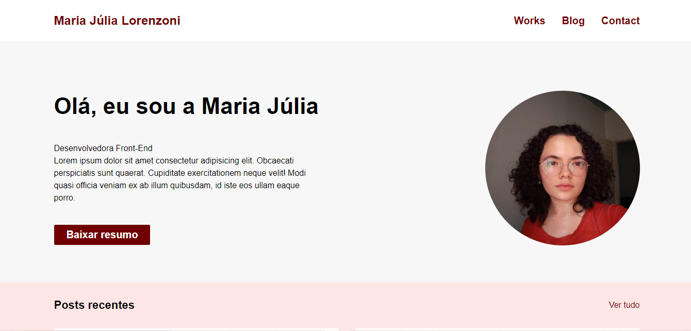
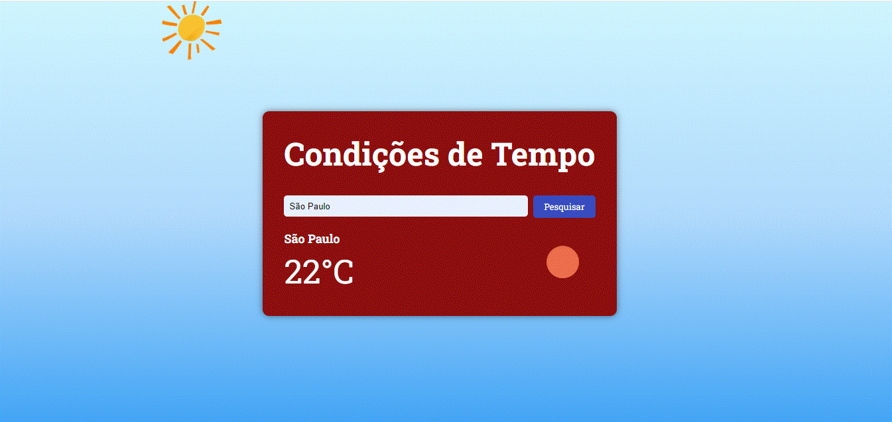

# Curso de FrontEnd em React - Ada Tech

Este repositório contém meu progresso e projetos desenvolvidos durante o curso.

## Módulo 1: HTML e CSS

No Módulo 1, aprendi sobre HTML e CSS, além do básico da responsividade.
Este foi o principal projeto do módulo: uma simples página de portifólio. 

## Módulo 2: Javascript

Aprendi sobre a integraçao do Javascript com o HTML, sobre funções e sobre programação assíncrona.

## Módulo 3: TypeScript, POO e Browser APIs

Aprendi a configurar as condições de ambietne para utilizar Typescript e integração com APIs.

O principal projeto do módulo foi uma página para verificar o clima no momento que o usuário pesquisa pela cidade desejada.

## Módulo 4: React I: Introdução e Componentes em Classe 
Em andamento.
